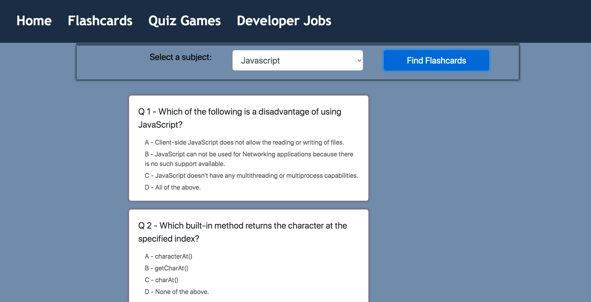

# Quiz Deck - flashcards for developers
> A simple flashcard app that helps new developers master programming skills and browse developer jobs posted on Github. The frontend is built with React and Redux, the backend is built with Ruby on Rails and PostgreSQL

## Table of contents
* [General info](#general-info)
* [Screenshots](#screenshots)
* [Technologies](#technologies)
* [Setup](#setup)
* [Features](#features)
* [Status](#status)
* [Inspiration](#inspiration)
* [Contact](#contact)

## General info
Add more general information about project. What the purpose of the project is? Motivation?

## Screenshots


## live demo


## Technologies
* React 16.13.1
* Redux 4.0.5
* Rails 6.0.3
* PostgreSQL 12.3
* Bootstrap 4

## Setup
* Install node.js
To run our application in development mode. 
```javascript
npm start
```
We can just navigate to http:localhost:3000 in any browser to preview our app live. 

## Code Examples
Show examples of usage:
`put-your-code-here`

## Features
List of features ready and TODOs for future development
* Awesome feature 1
* Awesome feature 2
* Awesome feature 3

## Inspiration
Inspired by [Quizlet](https://quizlet.com/) web app
